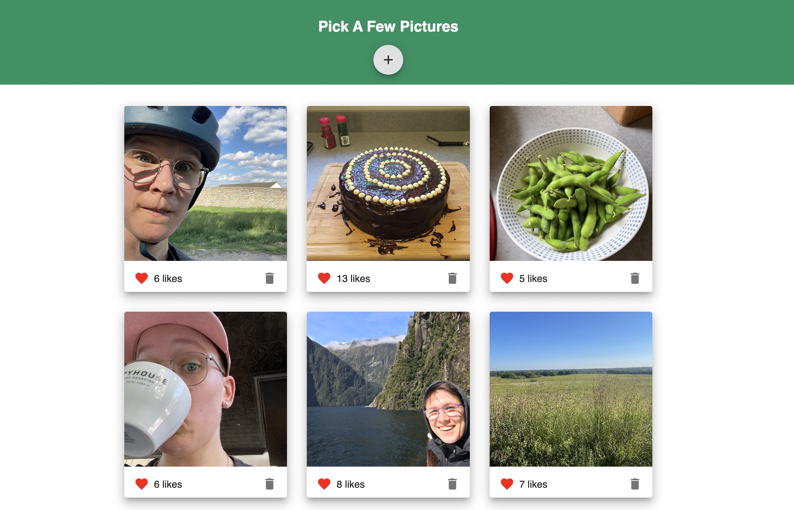

# PROJECT NAME

Pick A Few Pictures

## Description

_Duration: 1.5 weeks_

What problem did you solve? How did you solve it? 

Pictures are one of the best ways to convey an experience to someone or record memories for youself! Pick A Few Pictures is an application that catalogs and displays photos with a short description. 

Click an image to reveal the image description. Click again to return to the image.

The posts can be liked by others and can also be deleted if they are no longer relevant to you. Don't worry, you'll be asked to confirm the delete before it's permanent.

Click the 'Add' button at the top of the page to add an image to the gallery using a url link.

## Screen Shot

### Prerequisites

- [Node.js](https://nodejs.org/en/)
- [nodemon](https://nodemon.io/)
- [Postgres](https://www.postgresql.org/download/)

## Installation

1. Create a database named `react_gallery`,
2. The queries in the `database.sql` file are set up to create all the necessary tables and populate a collection of photos from my life to illustrate how the application displays content. The project is built on [Postgres](https://www.postgresql.org/download/), so you will need to make sure to have that installed. We recommend using [Postico](https://eggerapps.at/postico/) to run those queries as that was used to create the queries, 
3. Open up your editor of choice and run an `npm install`
4. Run `npm run server` in your terminal
5. Run `npm run client` in your terminal
6. The `npm run client` command will open up a new browser tab for you!

## Usage
How does someone use this application? Tell a user story here.

1. xxx
2. xxx
3. xxx
4. xxx
5. xxx
6. xxx

## Built With

- [Node.js](https://nodejs.org/en/)
- [nodemon](https://nodemon.io/)
- [Express](https://expressjs.com/)
- [React](https://reactjs.org/)
- [Postgres](https://www.postgresql.org/download/)
- [Material UI](https://mui.com/)
